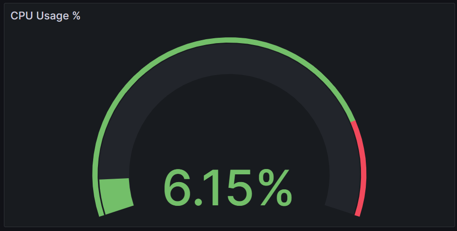
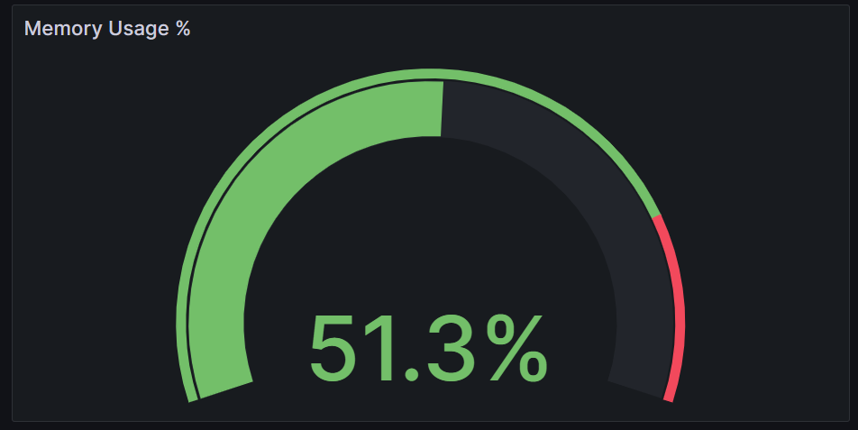
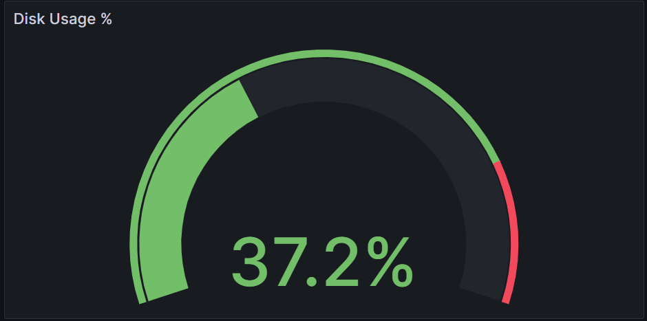
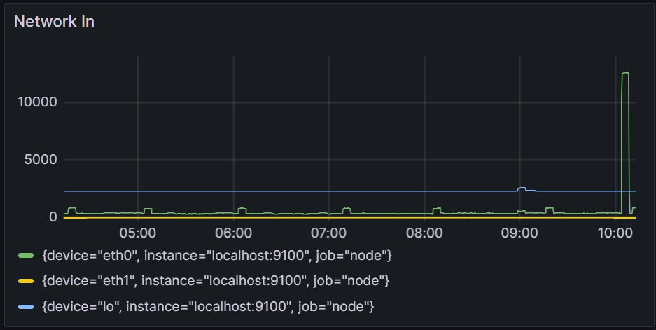
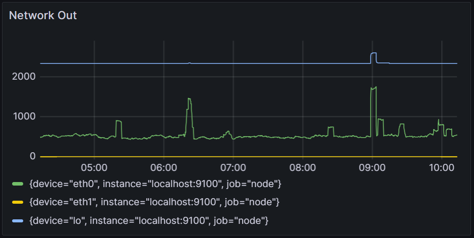
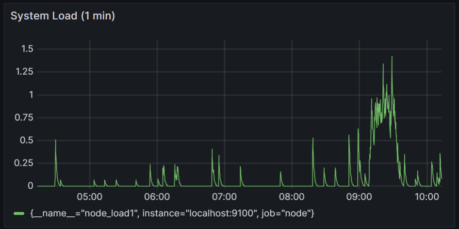
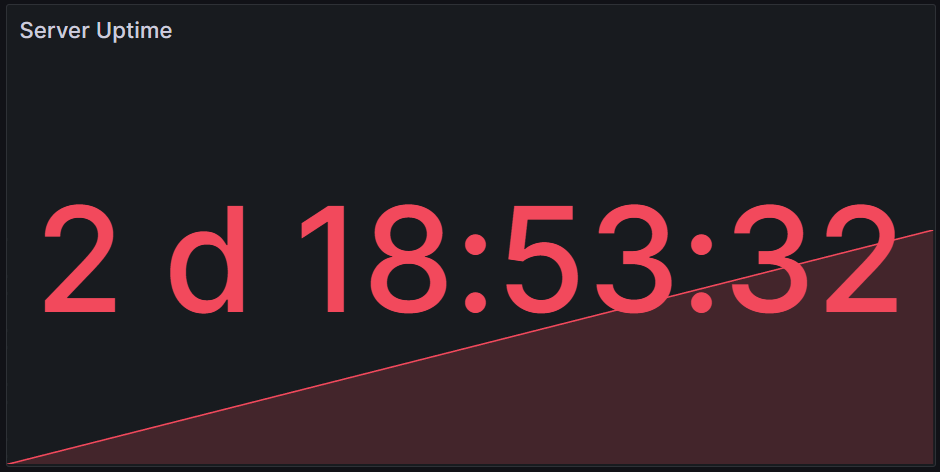
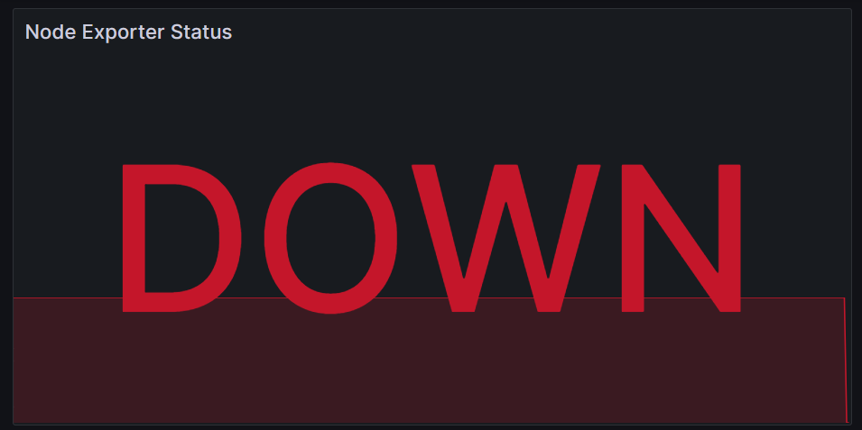
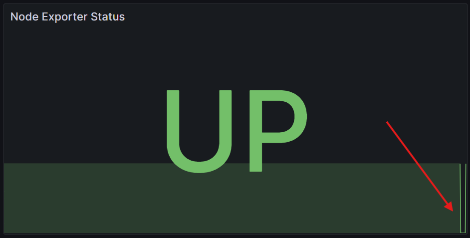

# Screenshots

This folder contains screenshots documenting the deployment, monitoring, validation, and recovery testing performed during the Fedora Firewall Monitoring Project.

## Dashboard Overview

The primary Grafana dashboard displaying key infrastructure metrics.

---

## Service Health Monitoring

Node Exporter operating normally and successfully reporting metrics to Prometheus.

---

## CPU Monitoring

CPU utilization monitored through Node Exporter and visualized in Grafana.

---

## Memory Monitoring

Real-time memory utilization monitoring.

---

## Disk Monitoring

Disk usage monitoring for capacity and storage management.

---

## Network In Monitoring

Inbound network traffic collected from monitored interfaces.

---

## Network Out Monitoring

Outbound network traffic visualization.

---

## System Load Monitoring

System load monitoring used to identify resource utilization trends.

---

## System Uptime Monitoring

Server uptime monitoring demonstrating system availability and stability.

---

## Monitoring Validation Test

To validate the monitoring environment, the Node Exporter service was intentionally stopped.

Grafana successfully detected the outage and displayed the service as unavailable.

---

## Service Recovery Validation

After restarting the Node Exporter service, Grafana resumed metric collection and reported the service as operational.

This confirmed that the monitoring stack could successfully detect both service failures and recoveries.

